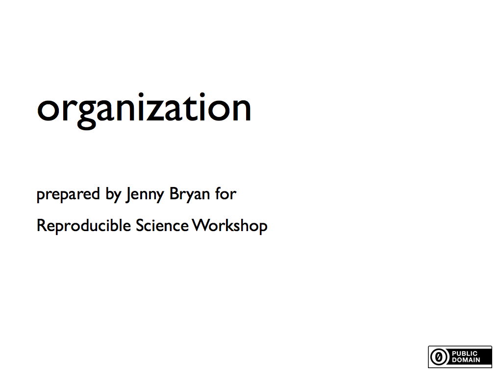
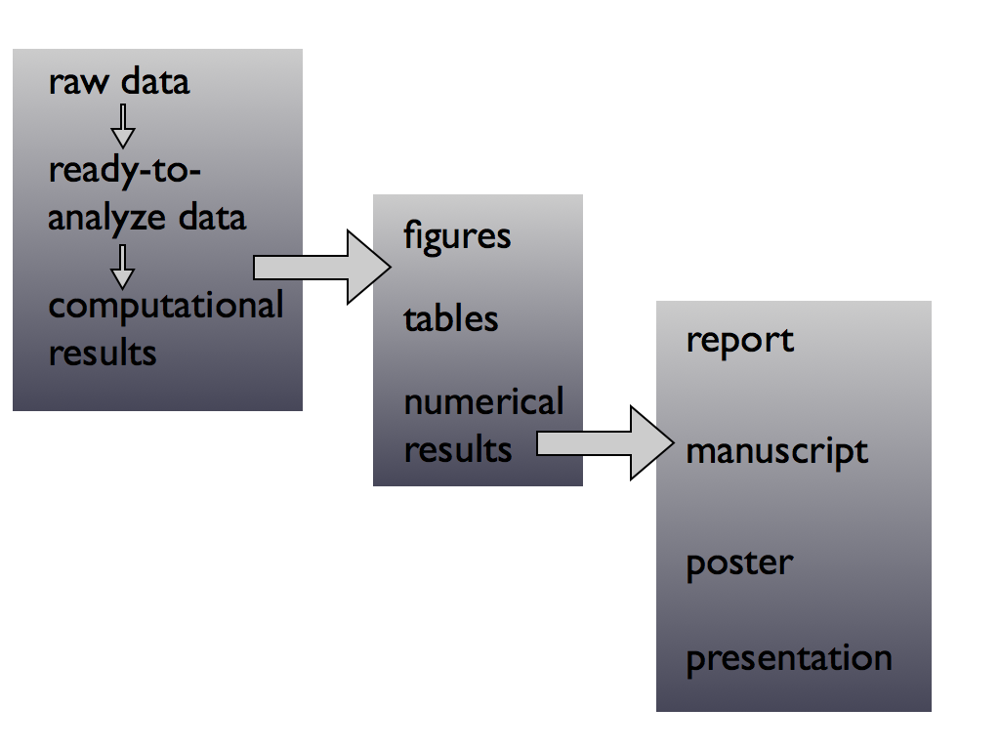
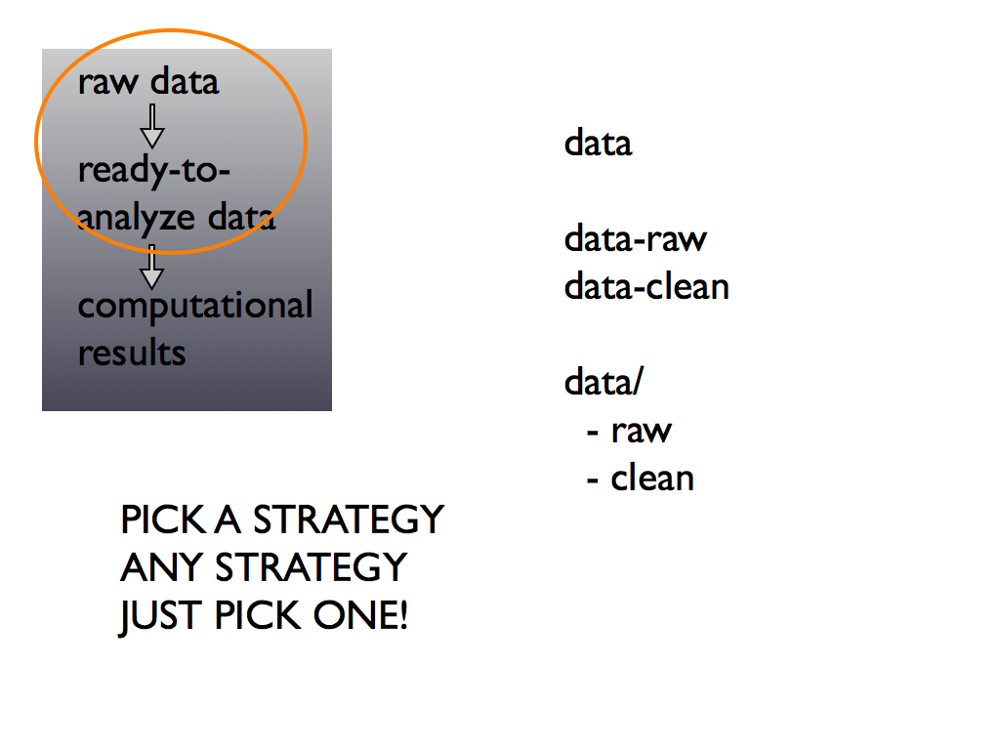
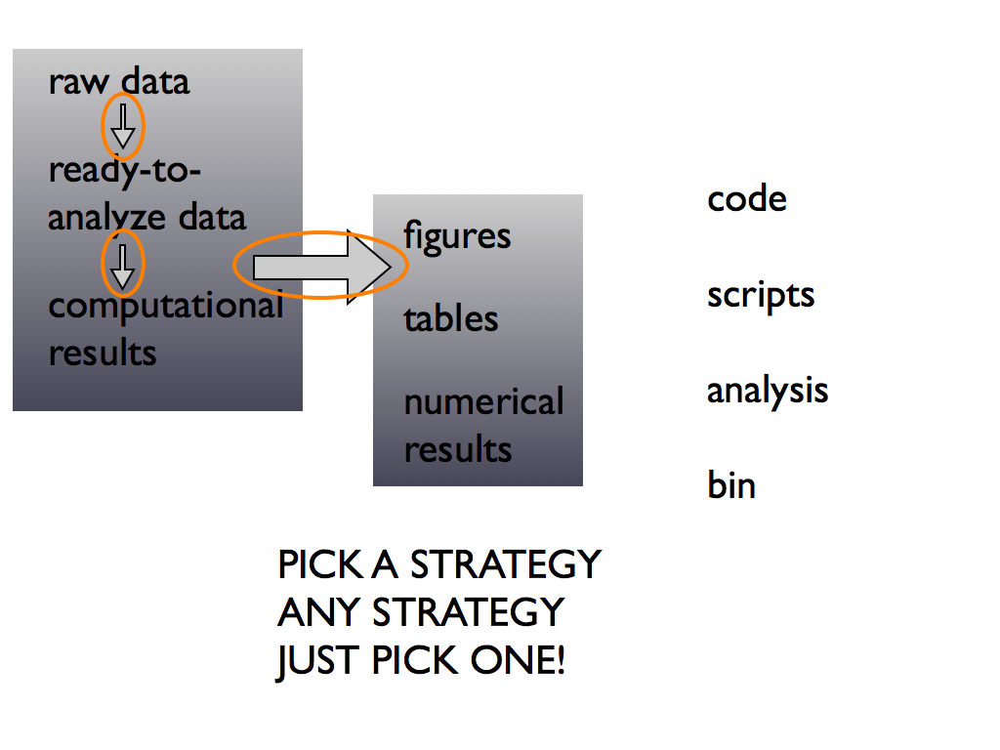
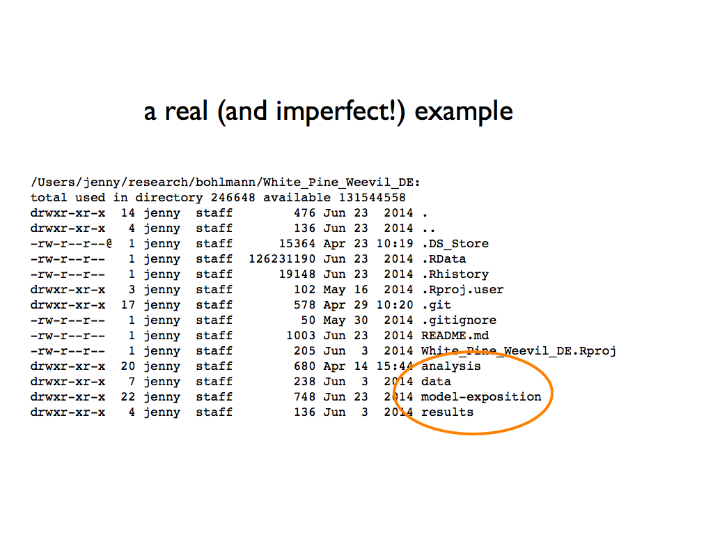
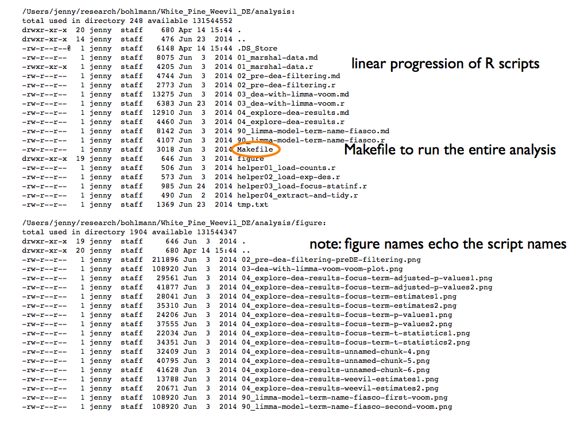
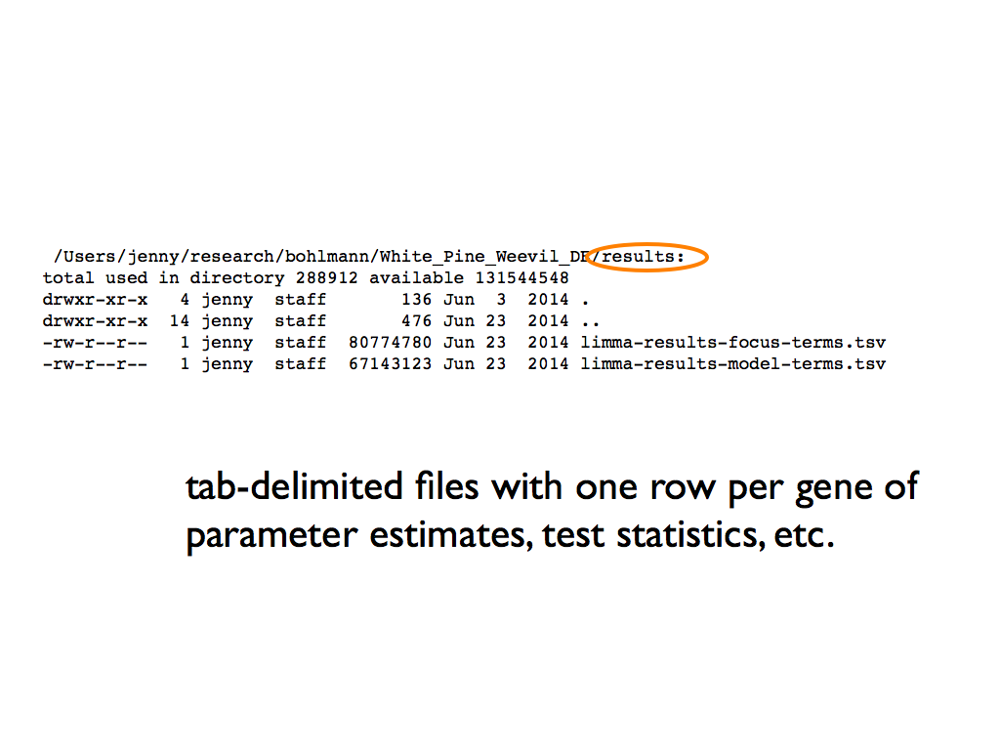
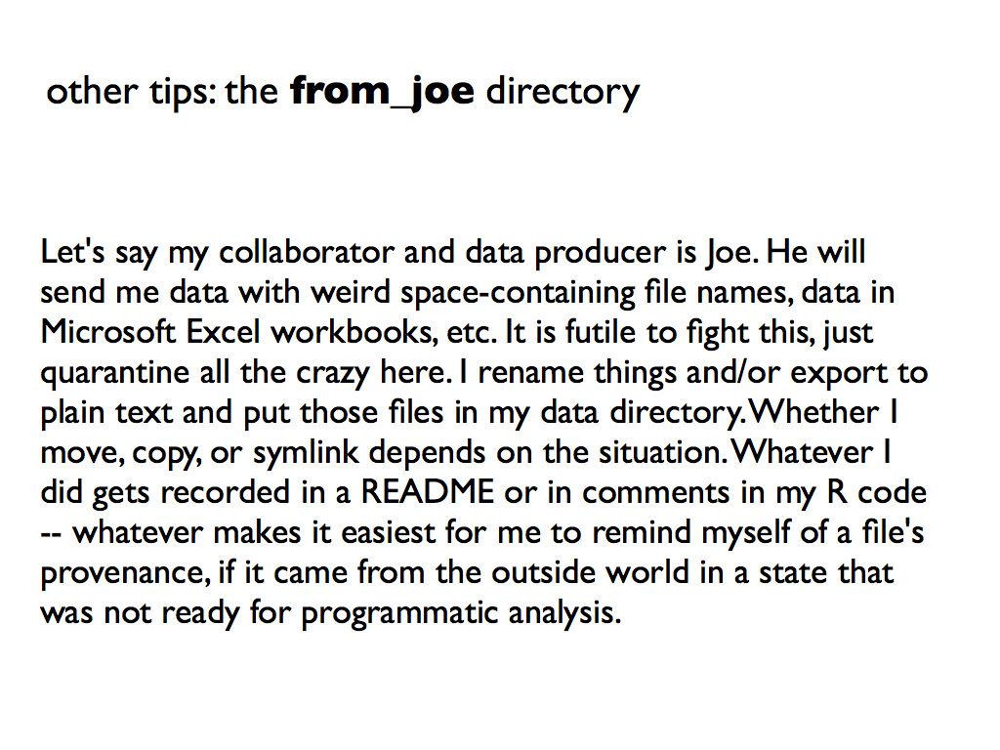
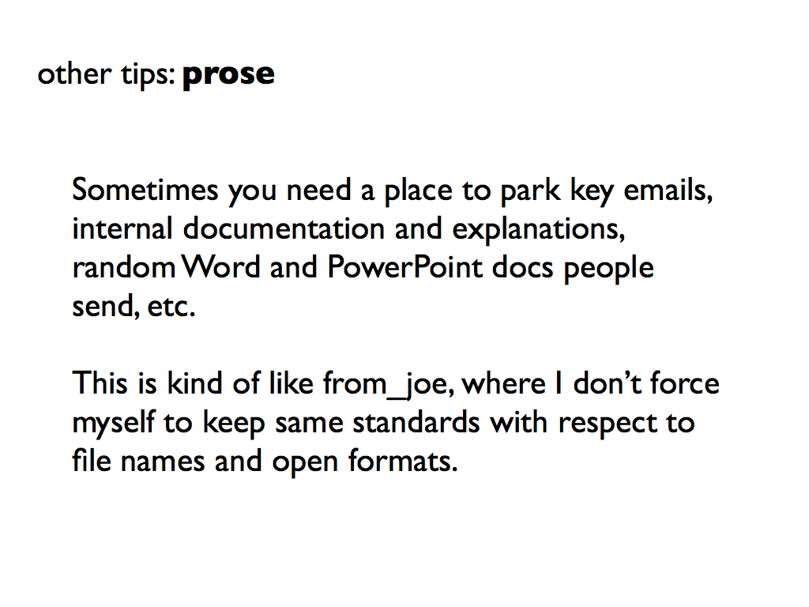

* organization-slides.001.png 
 * organization-slides.002.png 
 * organization-slides.003.png 
 * organization-slides.004.png 
 * organization-slides.005.png 
 * organization-slides.006.png 
 * organization-slides.007.png 
 * organization-slides.008.png 
 * organization-slides.009.png 
 * organization-slides.010.png 
 * organization-slides.011.png 
 * organization-slides.012.png 
 * organization-slides.013.png 
 * organization-slides.014.png 
 * organization-slides.015.png 
 * organization-slides.016.png 
 * organization-slides.017.png 
 * organization-slides.018.png 
 * organization-slides.019.png 
 * organization-slides.020.png 
 * organization-slides.021.png 
 * organization-slides.022.png 
 * organization-slides.023.png 
 * organization-slides.024.png 
