* naming-slides.001.png 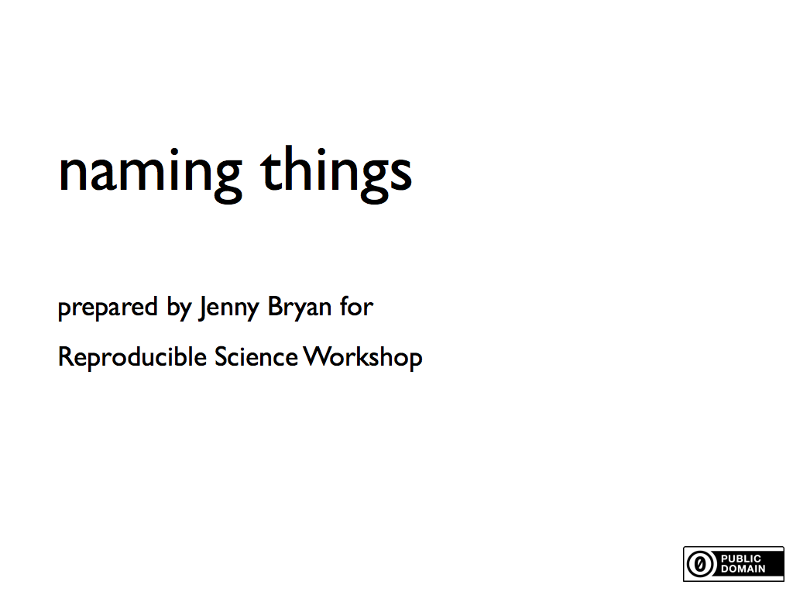
 * naming-slides.002.png 
 * naming-slides.003.png 
 * naming-slides.004.png 
 * naming-slides.005.png 
 * naming-slides.006.png 
 * naming-slides.007.png 
 * naming-slides.008.png 
 * naming-slides.009.png 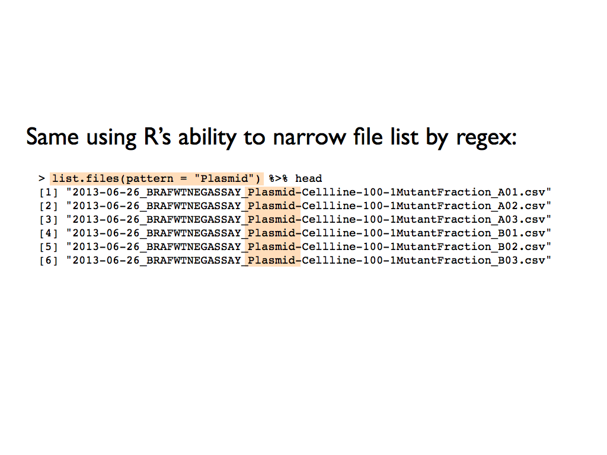
 * naming-slides.010.png 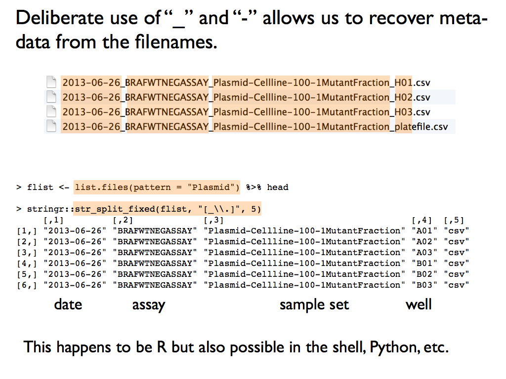
 * naming-slides.011.png 
 * naming-slides.012.png 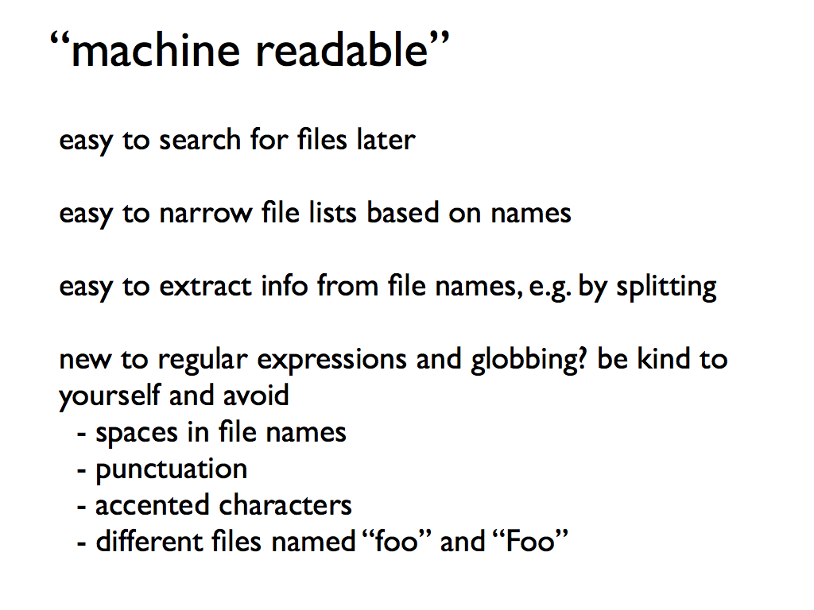
 * naming-slides.013.png 
 * naming-slides.014.png 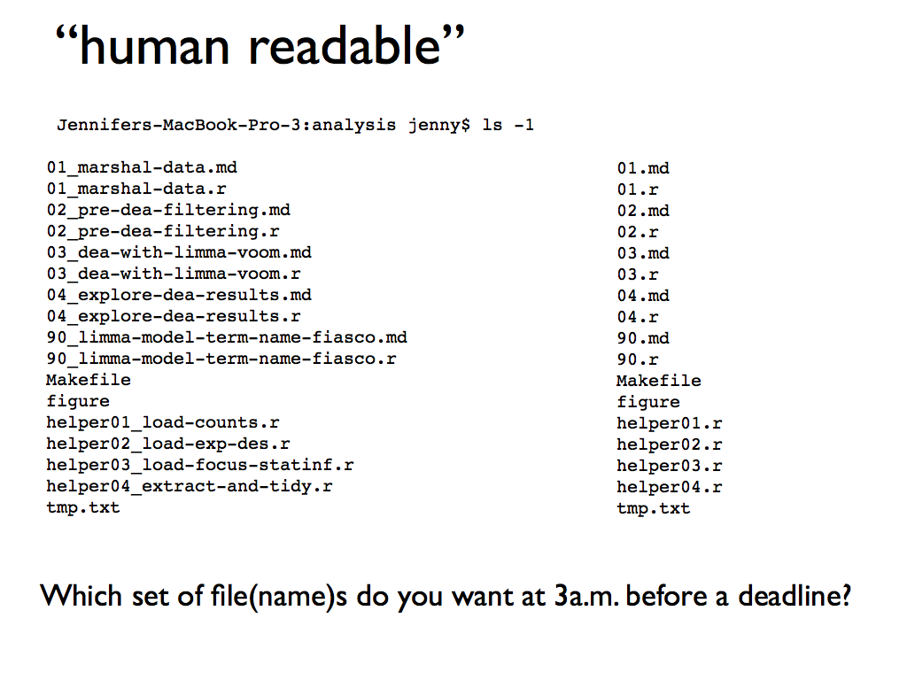
 * naming-slides.015.png 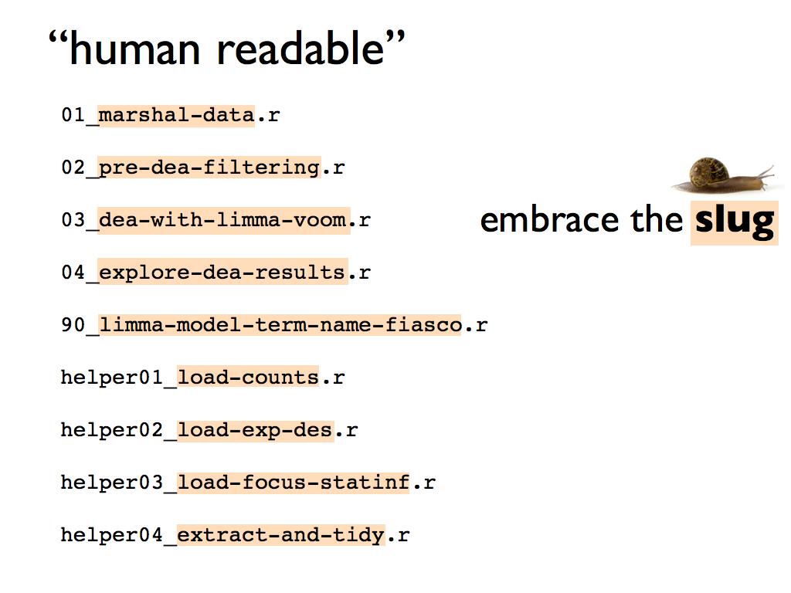
 * naming-slides.016.png 
 * naming-slides.017.png 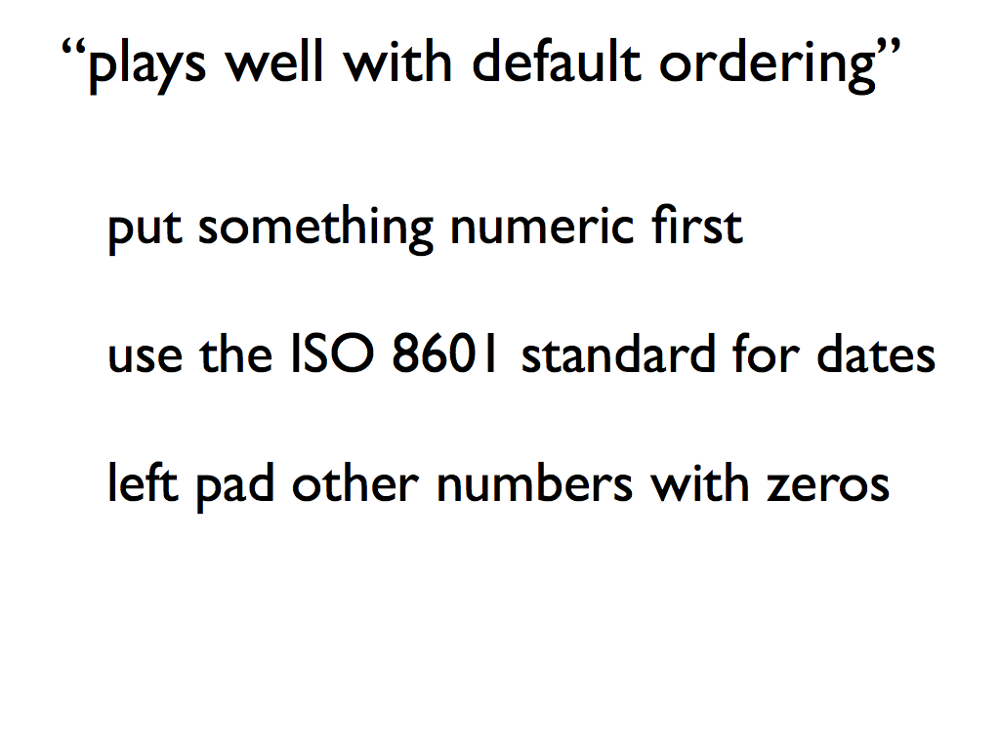
 * naming-slides.018.png 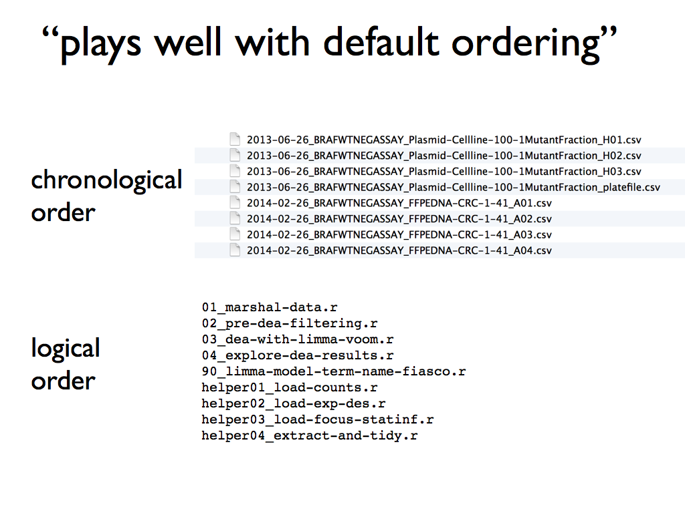
 * naming-slides.019.png 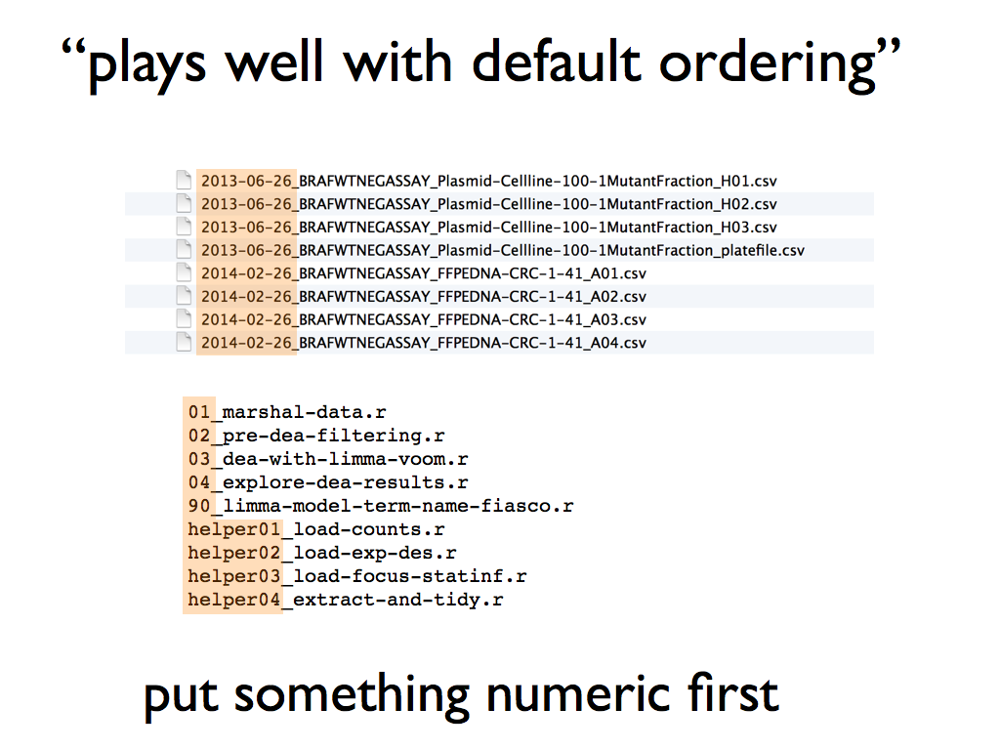
 * naming-slides.020.png 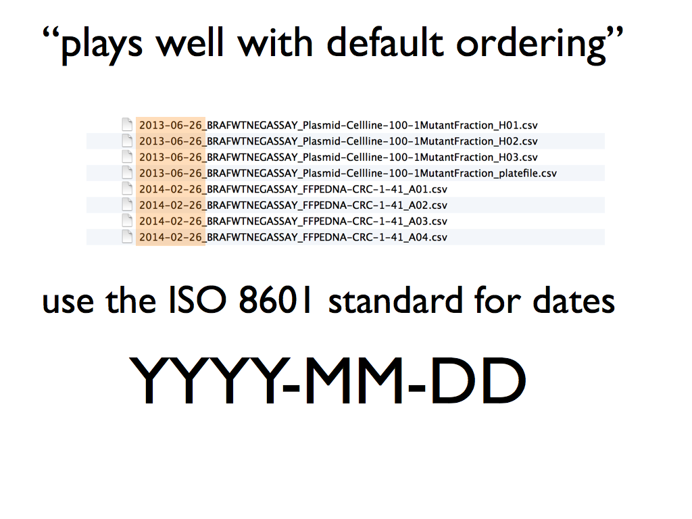
 * naming-slides.021.png 
 * naming-slides.022.png 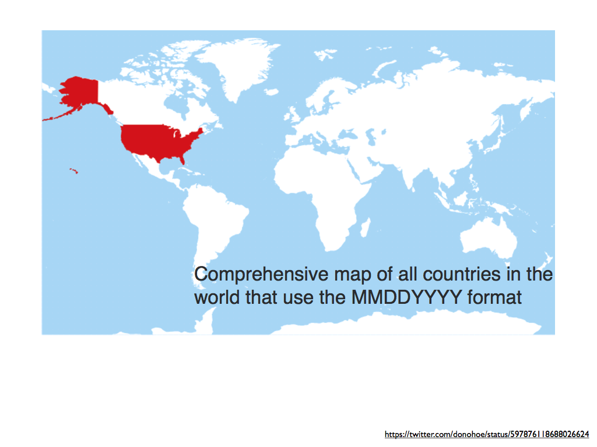
 * naming-slides.023.png 
 * naming-slides.024.png 
 * naming-slides.025.png 
 * naming-slides.026.png 
 * naming-slides.027.png 
